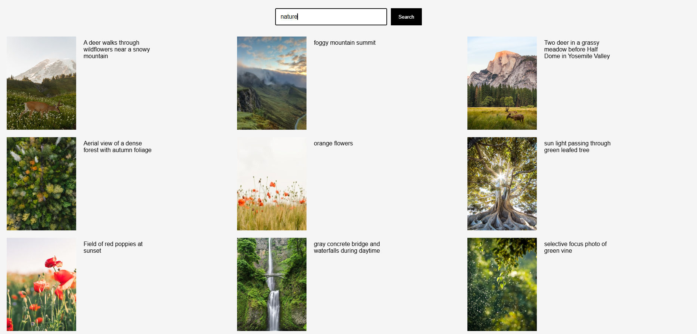
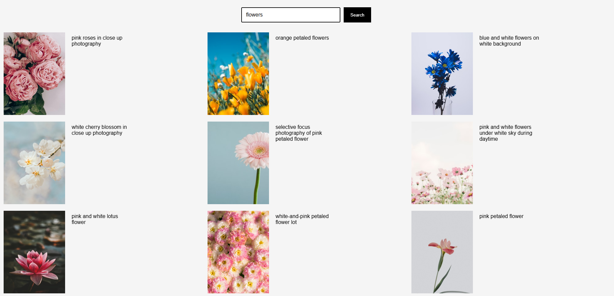
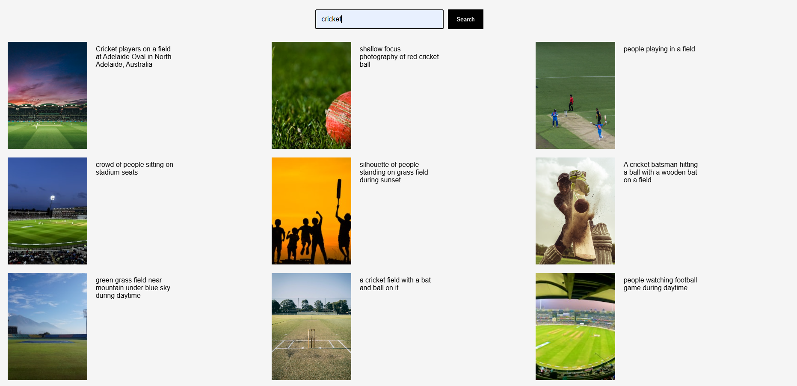

# Image Search Gallery

A simple image search website that allows users to search for images and view the results in a gallery.

## Features

- Search for images
- Display image search results
- Load more images using pagination
- Open images in a new tab
- Simple and clean interface

## Technologies Used

- HTML
- CSS
- JavaScript
- Image Search API

## How It Works

1. Enter a keyword in the search box.
2. Click the Search button.
3. The application fetches matching images.
4. The images are displayed in a gallery.
5. Click Show More to load additional images.

## Project Structure

Image-Search-Gallery/
│
├── index.html
├── gallery.css
├── gallery.js
├── README.md
└── screenshots/
    └── gallery.png

## Screenshot

## Setup

1. Clone the repository.
2. Open the project folder.
3. Add your API key in `gallery.js`.
4. Open `index.html` in your browser.

## Author

Omkar S Rajamane
